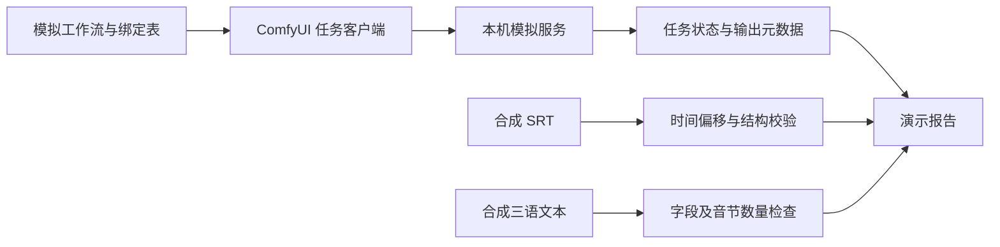

# Demo 架构

```mermaid
flowchart LR
    A[模拟工作流与绑定表] --> B[ComfyUI 任务客户端]
    B --> C[本机模拟服务]
    C --> D[任务状态与输出元数据]
    E[合成 SRT] --> F[时间偏移与结构校验]
    G[合成三语文本] --> H[字段及音节数量检查]
    D --> I[演示报告]
    F --> I
    H --> I
```

真实项目涉及角色视频生成、配音、字幕、媒体加工与发布。此 Demo 选取其中三个独立接口，便于运行和理解，不提供整套生产流程的复刻入口。

Skill 层描述任务范围和执行约束；Python 层完成确定性处理；演示入口通过模拟输入验证正常与异常行为。返回元数据、模型执行成功和成片质量是不同的验证层，本 Demo 只验证前者及本地文本转换。
