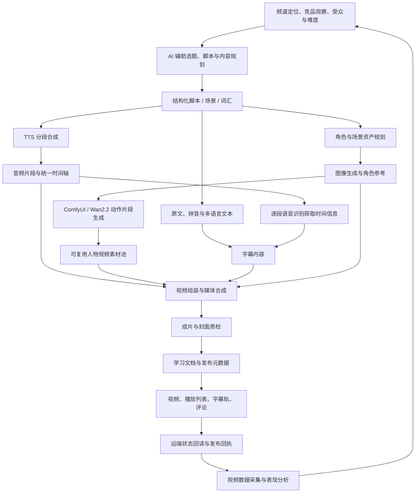

# SNE / SNC AI 内容生产系统：设计与改进

## 1. 项目背景

SNE（Simply Natural English）和 SNC（Simply Natural Chinese）是两个面向语言学习者的内容项目。它们共享一套生产思想，但服务不同的学习语言和内容形态：

- SNE 以自然英语输入为核心，包括双人对话、初级独白和短视频。
- SNC 以自然中文输入为核心，包括双人对话、慢速独白和中文表达短视频。

项目最初要解决的并不是“让 AI 生成一段视频”，而是把选题、脚本、配音、人物素材、字幕、成片、学习材料和发布组织成一条可以重复执行、局部返工和验证结果的内容生产链。

生成模型擅长创作，但输出具有不确定性；视频转码、时间轴、文件命名和发布接口则要求确定性。系统设计的核心是把这两类工作分开，用结构化文件连接各阶段，并在关键节点保留人工检查。

## 2. 设计目标

系统主要围绕六个目标设计：

1. **内容质量可控**：脚本受 CEFR 或 HSK 难度、角色设定、节目结构和教学目标约束。
2. **角色与视觉一致**：同一角色跨剧集保持身份、画风和左右位置稳定，固定栏目保持统一版式。
3. **长视频字幕同步**：避免整段语音识别带来的累计漂移，同时保留脚本原文的准确性。
4. **流程可恢复**：某张图、某句配音或某条字幕失败时，只返工对应阶段，不重跑整期。
5. **交付可验证**：本地文件生成成功不等于发布完成；成片、封面、播放列表和字幕轨都要分别核验。
6. **决策有数据依据**：制作前分析同类频道和目标受众，发布后验证自身视频数据，再把外部观察与内部表现共同用于下一轮选题和制作。

系统没有把“完全无人值守”作为目标。选题判断、语言审校、视觉验收和正式发布仍由人负责，AI 和程序负责扩大产能并减少重复劳动。

### 2.1 竞品与同类方案分析

SNE / SNC 同时属于语言学习内容产品和 AI 视频生产系统，因此竞品分析分为两层：第一层观察同类频道如何组织教学内容、建立栏目和积累受众；第二层比较现成 AI 视频工具能解决哪些生产问题，以及为什么仍需建设自己的工作流。

#### 内容侧：语言学习频道与内容品牌

下表数据统计于 2026 年 9 月 7 日。订阅、播放和视频数量为第三方平台根据 YouTube 公开信息整理的近似值，会随时间变化；这些数据用于判断市场规模和内容供给，不直接代表教学质量，也不能单独证明某种形式导致增长。

| 竞品 | 公开规模 | 主要内容特点 | 对 SNE / SNC 的启发与差异 |
|---|---:|---|---|
| [BBC Learning English](https://socialblade.com/youtube/handle/bbclearningenglish) | 约 1,080 万订阅、5.24 亿播放、4,453 条视频 | 覆盖新闻英语、词汇、语法、发音和短内容，依靠专业编辑团队形成高频、长期内容供给 | 证明栏目化和持续更新的重要性；SNE 不具备机构品牌与内容规模，因此更聚焦固定角色、连续生活场景和可重复的初级输入 |
| [English Easy Practice](https://socialblade.com/youtube/handle/englisheasypractice) | 约 291 万订阅、9,094 万播放、261 条视频 | 一期内容通常串联对话、词汇、听答和跟读；其官网还提供普通/慢速音频及 MP3、PDF 学习材料 | 与 SNE 的自然对话和学习材料最接近；其优势是成熟课程结构，SNE 的差异是用固定人物 IP、多种节目形态和自动化生产链维持系列一致性 |
| [Mandarin Corner](https://socialblade.com/youtube/handle/mandarincorner2) | 约 30.3 万订阅、2,532 万播放、335 条视频 | 官网按初级、中级及 HSK 1—6 组织慢速中文、真实对话、词汇、音频和字幕材料 | 验证了分级、真实语境和配套文本的价值；SNC 更强调初级剧情、中文/拼音/英文三层字幕，以及面向多母语学习者的独立字幕轨 |
| [ShuoshuoChinese 说说中文](https://socialblade.com/youtube/handle/shuoshuochinese/realtime) | 约 31.2 万订阅、1,643 万播放、338 条视频 | 围绕真实中文表达、词汇和文化语境持续生产教学内容 | 说明学习者需要教材之外的自然表达；SNC 采用固定角色和生活剧情承载同类目标，并把难度、字幕和素材约束写入生产流程 |
| [Chinese with Jessie](https://socialblade.com/youtube/handle/chinesewithjessie) | 约 214 万订阅、16.89 亿播放、443 条视频 | 以短视频、生活观察和文化反差获得大范围传播，娱乐属性强 | 证明短内容和鲜明人物对触达新观众的作用；SNC 同时保留短视频与系统化长内容，但不会用传播性取代语言分级和学习连续性 |

内容形式参考：[English Easy Practice 课程结构](https://englisheasypractice.com/)、[Mandarin Corner 分级内容与学习材料](https://mandarincorner.org/)。

对内容竞品的分析形成了四个结论：

1. **稳定栏目比单条爆款更可复用**：成熟频道通常有重复出现的节目结构、标题语言和教学环节，因此 SNE / SNC 将对话、独白和短视频分别定义模板，而不是每期重新设计形式。
2. **长内容与短内容承担不同任务**：短视频适合触达和验证选题，长视频适合提供完整语境、跟读和词汇学习，两者需要共享角色与选题数据但使用不同节奏。
3. **视频之外的学习资产会提高内容价值**：字幕、词汇、音频和 PDF 在多个竞品中反复出现，因此项目把学习文档和独立字幕轨纳入正式交付，不把它们作为发布后的临时补充。
4. **成熟竞品的优势不能由自动化直接替代**：真人表达、教师信誉、社区关系和长期品牌积累仍是 SNE / SNC 的差距。系统能提高稳定性和试验速度，但内容效果仍需由点击率、观看时长、留存和用户反馈验证。

#### 工具侧：通用 AI 视频与剪辑产品

| 同类工具 | 公开能力数据 | 擅长解决的问题 | 与本项目的边界 |
|---|---|---|---|
| [HeyGen](https://www.heygen.com/en-in/tool/text-to-video) | 官方页面列出 700+ 虚拟人、175+ 语言及方言、自动字幕和最高 4K 导出 | 快速生成口播虚拟人、配音翻译和多语言版本，编辑界面完整 | 适合标准化口播和本地化；SNE / SNC 需要剧情场景、固定卡通角色、当期造型、教学分级和自定义三语字幕，生产目标不只是一名虚拟人正确念稿 |
| [InVideo AI](https://help.invideo.io/en/articles/9387980-can-i-generate-a-video-in-other-languages) | 官方说明支持 50+ 语言，但简体中文等部分语言暂不支持自动字幕 | 从提示词快速生成脚本、素材、旁白和成片，适合低门槛的一站式制作 | 生成速度快，但语言支持不等于教学字幕正确；SNC 必须控制中文、上下文拼音、英文翻译及时间映射，不能把通用自动字幕直接作为最终学习内容 |
| [CapCut](https://www.capcut.com/resource/google-translate-camera) | 支持自动字幕、双语字幕、SRT/TXT 导出和视频分享 | 时间轴编辑直观，适合人工精修和快速交付 | 项目第一阶段已经使用同类人工剪辑流程；当剧集增多后，逐句替换、批量转码、字幕复用和状态记录仍需要重复操作，因此才把确定步骤逐步迁移到脚本与流水线 |

通用工具的共同优势是上手快、界面成熟，并持续提高虚拟人、多语言和一键成片能力。自建系统在模型质量、编辑体验和素材库规模上并不全面优于这些产品。继续自建的原因是需要同时控制以下几个相互关联的业务约束：

- SNE 的 CEFR 分级与 SNC 的 HSK、中文、拼音和英文结构。
- 固定角色的长期身份、当期造型和跨镜头一致性。
- 使用审校脚本保证字幕内容，使用 Whisper 提供实测时间，而不是完全依赖自动转写。
- 某句配音、某张图或某个视频片段失败后的局部返工与断点恢复。
- 封面、学习材料、多语言字幕轨、播放列表和发布状态的统一核验。
- 竞品观察、选题假设、发布数据与下一轮内容改进之间的反馈闭环。

#### 历次数据分析、改进与结果

项目不是在开工前只做一次竞品调研，而是把频道数据按阶段拉回，与同类内容和自身历史表现共同分析。下表来自 2026 年 6—7 月保存的 YouTube Analytics 快照及分析记录。频道当时仍处于小样本阶段，因此保留原始数量级，并区分“已经观察到的结果”和“仍需继续验证的假设”。

| 时间与分析对象 | 数据发现 | 采取的改进 | 后续观察与结论 |
|---|---|---|---|
| 2026-06-04，SNE Shorts 拉新与钩子 | 同期 3 条 Shorts 一天带来 10 个订阅，而此前长视频两周带来 13 个；首轮播放约为 195、76 和 8 | 提高 Shorts 优先级；标题和第一句改为反转式钩子，并尝试通过简介、置顶评论和对应选题连接长视频 | 低播放的 `What's Up` 后来追上，并带来 3 个订阅且没有点踩；另外两条各带来 2 个订阅且都有点踩。结论由“只追反直觉播放”修正为“实用痛点 + 反转钩子”，评估同时看播放、订阅转化和负反馈。后续跨系列分析又发现长视频的 Shorts 来源为 0%，说明当时尚未形成可测量的短转长漏斗 |
| 2026-07-10，SNE 双人对话选题 | “一个功能场景 + 一批短语”的视频播放为 92、74、42、39；单个俚语深挖为 8、11、12、15，热点足球俚语也只有 17 | 对话优先解决拒绝、听不懂、投诉、打电话、看医生等完整沟通任务；标题给出明确功能和可数的学习收益，单个俚语主要交给 Shorts | 后续选题从单词解释转向机场、面试、退款、电话、就医、餐厅和住房报修等功能场景。每次先排除已做类目，再检查竞品集中在什么角度，例如住房题避开饱和的“怎么租房”，改做“如何让房东真正处理报修” |
| 2026-07-15，SNE A2 独白 19 期 | 合计 1,002 次播放、增加 20 个订阅。宅家 routine 首周平均播放 79.2，实用办事类为 35.0；但实用类加权留存 15.1%、订阅转化 3.62%，均高于 routine 的 12.7% 和 1.79%。94% 播放发生在首周 | 建立“双引擎”排播：舒适 routine 负责触达，实用场景负责留存和订阅；减少时事热点，把片长从膨胀的 12 分钟收回 8—9 分钟 | 第一条按策略制作的是 `Cook Dinner With Me`，采用宅家题、`With Me` 标题和 8 分 41 秒片长。保存记录中没有完整的同龄复盘，因此该条只证明策略已经落地，不能声称效果已经验证；双引擎仍作为待扩大样本的方向 |
| 2026-07-15，SNC 慢速独白 20 期 | 合计 1,782 次播放、增加 56 个订阅。早晨 routine 为 278 播放/+10 订阅，下雨天为 207/+8；去医院为 108/+7，订阅转化约 6.5%；游泳、高铁、世界杯等活动题表现较弱 | 优先 routine、宅家舒适和赴华可用的生活办事场景，降低活动、体育热点和一次性事件题比例 | 首条晚间 routine 在约 8 天时为 45 播放、29.7% 留存、+1 订阅。留存高于 7 月 27 日频道整体的 19.6%，但播放没有复现头部 routine，说明单条样本支持“内容更粘”，仍不足以证明流量增长 |
| 2026-07-16，189 条内容与 104 条留存曲线的跨系列分析 | SNE 对话前 10% 流失的中位数约 75.6%，片长与前段流失相关系数仅 0.02，说明主要是开场问题；SNC Shorts 基线留存约 32.8%，明显低于 SNE Shorts 的 70.5% | SNE 对话不再先砍时长，而是把学习收益前置到 30—60 秒；SNC Shorts 第一秒改用可听懂的英文钩子，中文答案延后一拍，并把目标时长缩到 32—42 秒 | SNC 首条新结构 `显眼包` 完成了脚本、TTS、动态段落、字幕和发布的端到端验证，但截至 7 月 27 日只有 24 播放、20.2% 留存和 0 订阅，没有超过原基线。结论是工程改造跑通不等于内容指标改善，不能因为一次发布成功就固化策略 |
| 2026-07-24 至 07-27，SNC 元学习内容 | 首轮 3 条“如何学习中文”内容，同龄播放只有 6—7，常规晚间 routine 同期达到 43；初步判断元学习题材脱离了推荐簇 | 先停止新增元学习慢速独白，并继续观察同题材的双人对话版本 | 随后的“中文学习瓶颈”双人对话在前两天达到 94 播放，是此前长视频最佳同期 22 播放的 4.3 倍。同轮数据还显示，对话每次播放贡献约 3.0—6.1 分钟观看，慢速独白约 0.7—2.4 分钟。最终结论从“元学习题材不行”修正为“题材与载体必须一起判断”：元学习更适合 HSK 4—5 双人长对话，不适合初级慢速独白 |

从 7 月 8 日到 7 月 27 日的两次 SNC 全频道快照中，订阅数从 179 增至 216，Analytics 播放从 8,468 增至 9,387，平均观看时长从 1 分 45 秒增至 1 分 49 秒，平均留存从 19.1% 增至 19.6%，相关视频流量占比从 17.3% 增至 19.9%。这段时间同时发布了多条新内容，数据只能作为阶段变化，不能把增长全部归因于某一项改进。

这些分析带来的长期方法是：先提出可以被数据否定的假设，再规定观察窗口和指标；播放量、留存、观看分钟、订阅转化和流量来源分开判断；新证据与旧结论冲突时允许修改策略，而不是为了证明最初判断正确而选择性使用数据。

#### 对比结论与项目定位

竞品数据证明语言学习视频拥有明确需求，成熟频道也已经验证了自然对话、分级输入、短内容获客和配套学习材料等形式。HeyGen、InVideo AI 和 CapCut 则证明通用工具能够显著降低单条视频的制作门槛。

SNE / SNC 的定位不是重新实现一个通用视频编辑器，也不是宣称内容规模或品牌影响力超过成熟频道。项目的差异在于把**语言教学规则、连续角色资产和可恢复的媒体工程**放入同一套生产系统：内容侧用 CEFR / HSK、原文和多语结构约束质量，视觉侧用角色参考和素材池维持连续性，工程侧用时间轴、状态记录和发布回执保证可重做、可检查。

因此，现阶段的主要优势是针对两个具体频道形成了更细的控制能力和更快的试验闭环；主要不足是受众规模、真人信任感、社区运营、编辑器易用性和数据样本仍无法与成熟竞品相比。后续比较不只观察订阅总量，而会持续记录点击率、前段留存、平均观看时长、单期制作时间、返工次数和字幕问题数量，用自身数据判断这些设计是否真正改善内容表现与生产效率。

## 3. 从一次性制作到流水线

### 阶段一：网页 AI 工具与人工剪辑验证内容形态

项目最初采用以人工操作为主的内容制作方式：我先确定选题、受众和节目结构，再使用 GPT 网页端辅助生成脚本、翻译和图片；在可画中制作封面、背景及其他视觉素材；最后把文稿、配音、图片和字幕导入剪映，手工调整时间轴并完成视频。

这个阶段的目标是快速验证频道定位和内容形式，而不是立即建设自动化系统。它验证了 AI 可以参与语言学习内容的脚本创作、跨语言处理和视觉生产，也让我积累了对角色、字幕密度、画面节奏和学习难度的具体判断标准。

随着视频数量和内容形态增加，人工流程的限制逐渐出现：同样的步骤需要反复操作；网页对话中的规则难以稳定复用；角色和版式容易在不同批次发生偏差；剪映中的时间轴调整难以批量复制；修改一句台词可能连带返工配音、字幕和画面；制作状态也缺少统一记录。

因此，后续演进不是简单地“换一个生成工具”，而是把已经验证过的人工制作经验拆成明确步骤，再逐步用结构化文件、Python 工具和 Skills 固化。

### 阶段二：用中间产物定义模块边界

流水线逐步形成了一组稳定的文件契约：

| 阶段 | 主要输入 | 主要输出 |
|---|---|---|
| 内容设计 | 话题、难度、角色、时长 | 分段脚本、词汇和场景规划 |
| 语音 | 逐回合或逐句脚本 | 编号 WAV、时长和时间轴 |
| 视觉 | 角色设定、场景要求 | 封面、背景、立绘或动作片段 |
| 字幕 | 脚本原文、时间信息 | SRT、ASS、拼音和译文 |
| 成片 | 音频、视频素材、字幕、模板 | 可审阅 MP4 |
| 发布 | 成片、封面、元数据、字幕轨 | 平台对象和发布回执 |

这些中间产物既是模块接口，也是可检查的断点。例如，只修改一句台词时，可以重做对应 WAV 和后续时间轴；只修改封面时，可以复用已经确认的音频和主体视频。

### 阶段三：先用完整样例引导 AI，再沉淀为 Skills

我没有在一开始就凭空写出整套自动化规则，而是先选择一条具有代表性的内容，带着 AI 完整制作一遍。我给出栏目目标、参考素材和阶段要求，让 AI 逐步完成脚本、配音、画面、字幕、合成和检查；每一步都查看实际结果，并通过多轮沟通纠正语言风格、人物一致性、字幕节奏和画面结构，直到成片达到可接受标准。

在这个过程中，我不会只让 AI 修复当前结果。每次发现问题，还会继续判断它属于偶发生成错误、可程序检测的问题，还是需要长期遵守的内容规则：

1. 偶发生成错误保留局部重做入口。
2. 可确定判断的问题写入 Python 校验或质量检查。
3. 需要语义判断的问题写成 Skill 中的执行规则和检查清单。
4. 经过确认的成片、封面和文件结构作为后续任务的参考样例。

第一条完整样例跑通后，再把其中稳定的步骤抽象成可复用模块，并继续用后续剧集修正规则。这种方法可以称为**单样例驱动的工作流归纳**：先通过一个完整案例把隐性的制作经验暴露出来，再将多轮反馈固化为外部记忆。AI 的学习结果保存在 Skills、参考样例、模板、脚本和质量门禁中。

在模块边界稳定后，我把任务说明、输入输出、约束、执行顺序和错误处理写成独立 Skill。总控 Skill 负责编排，子 Skill 负责脚本、TTS、ComfyUI 任务、字幕、合成、学习文档和发布等单一职责。

Skill 不只是提示词模板。它更像 AI Agent 可读取的操作协议：告诉 Agent 何时调用哪个工具、使用哪些文件作为事实来源、哪些检查是阻断条件，以及失败后应该查询状态、局部重试还是停止交付。

这种设计让创作规则与机械代码分离。节目定位变化时可以修改 Skill；文件处理逻辑变化时可以修改 Python 工具；两者不需要同时重写。

## 4. 总体架构

架构中的生成环节和确定性处理环节通过文件连接。即使替换图像模型、TTS 服务或发布平台，脚本、时间轴和字幕等核心契约仍可继续使用。

## 5. 关键技术决策

### 5.1 竞品分析服务于假设，不直接复制内容

在确定选题前，我会观察同类语言学习频道的公开内容，包括高频选题、标题表达、封面信息层级、视频时长、开场方式、讲解结构、更新节奏和评论区反复出现的学习需求。AI 用于整理样本、聚类主题、总结共同模式并生成候选方向，减少完全依赖个人直觉选题。

分析结果不会直接变成对某条视频的复刻，而会整理为可验证的产品假设，例如“生活冲突型话题是否比知识讲解更容易获得点击”“更早进入对话是否改善前段留存”“初级学习者是否需要更短的句子和更明显的字幕层级”。每个假设再对应到选题、开场、封面或视频结构中的一个具体调整。

竞品数据只能说明市场中已经存在的表达方式，不能代替频道自身数据。因此我会结合频道规模、发布时间和内容类型判断样本，优先寻找重复出现的模式；脚本、角色、视觉资产和具体表达仍按 SNE / SNC 的定位重新设计。发布后再用自己的点击率、观看时长和留存验证假设是否成立。

### 5.2 ComfyUI 生成片段，成片程序负责调度

人物动作片段由本地 ComfyUI / Wan2.2 图生视频工作流生成。程序负责准备输入、替换允许变化的参数、提交任务、轮询状态、收集输出和记录失败。

我没有让模型为每句台词即时生成视频，而是先建立按角色、场景、服装和朝向组织的短片素材池，再按照音频长度选择和拼接。这降低了单期制作对 GPU 推理的耦合，也让生成失败不会阻塞整条成片流程。

### 5.3 脚本负责字幕内容，语音识别只负责时间

直接把语音识别结果当字幕会引入漏词、同音词和专有表达错误。因此系统将两个职责分开：

- 字幕文字来自已经审校的脚本原文。
- 语音识别只提供词级或句级时间信息。

对于双人对话，每个回合本身较短，可以逐段识别并映射回脚本；对于独白，先把段落拆成句子，再逐句 TTS 和识别。所有绝对时间由统一时间轴累加得到，从源头减少长音频识别产生的累计漂移。

当识别词数与脚本词数不一致时，系统在当前短片段内做受限对齐，不把误差扩散到后续内容。SRT、ASS、场景切换和音频拼接共同读取同一份时间信息。

### 5.4 SNE 与 SNC 共享骨架，保留语言差异

两个频道复用任务编排、媒体处理、生成任务和发布接口，但教学层不强行统一。

| 设计点 | SNE | SNC |
|---|---|---|
| 难度约束 | CEFR 分级与自然英语表达 | HSK 分级与自然中文表达 |
| 对话脚本 | 英文角色对话 | 中文角色对话 |
| 画面内字幕 | 英文卡拉 OK 高亮 | 中文、拼音、英文三层字幕 |
| 语言校验 | 原文、词级时间和断句 | 中文分段、上下文拼音和自然英文 |
| 独白时间轴 | 逐句语音与逐句识别 | 逐句语音、逐字时间与三语映射 |
| 发布字幕 | 为非英语观众提供独立字幕轨 | 为非中文观众提供独立字幕轨 |

这种“共享基础设施、保留领域规则”的设计避免了复制两套完整系统，也防止为了代码复用而牺牲教学体验。

### 5.5 生成模型负责内容，模板负责稳定结构

人物、场景和封面需要生成模型的表达能力；视频窗口、字幕安全区、分辨率和媒体编码需要程序的稳定性。系统为两者划定边界：

- 角色参考图和栏目视觉规则限制身份与画风漂移。
- 固定模板控制视频窗口和字幕区域。
- 生成后的正式图片同时检查原尺寸和小尺寸可读性。
- FFmpeg 统一不同来源素材的帧率、尺寸、像素格式和音频规格后再拼接。

视觉是否正确不能只靠分辨率和文件存在性判断，因此最终质量检查必须查看从成片抽出的真实帧。

### 5.6 失败可恢复，外部写操作可核验

长流程中的步骤会失败，设计重点是让失败位置清晰并避免重复副作用：

- 中间文件存在时允许跳过已完成阶段，也支持只重做指定句子或素材。
- ComfyUI 任务区分等待、成功、失败和超时，保留任务 ID。
- 对可能已经成功的提交不盲目重试，先查询远端状态。
- 发布后回读视频处理状态、封面、播放列表和字幕轨状态。
- 用构建记录、质量报告和发布回执区分“已生成”“已上传”和“已可用”。

## 6. 问题驱动的设计改进与质量门禁

这套系统不是一次设计完成的。多数规则来自实际制作中出现的问题，再被转化为新的素材结构、程序逻辑或质量门禁。

### 6.1 单人剧情中人物造型跨场景漂移

**问题**：单人独白通常包含多个生活场景。如果每张场景图都直接使用通用角色设定作为参考，生成模型容易在不同场景中改变当期服装、发型细节、配饰和人物比例。单张图看起来合理，连续播放时却不像同一天发生的故事。

**方案**：在生成本期场景前，先根据基础角色设定和本期服装要求生成一张专属人物三视图。三视图成为本期全部场景图的主参考，形成“基础人设 → 当期造型三视图 → 分镜场景图”的两级约束。基础人设锁定角色身份，当期三视图锁定本集服装和造型。

**结果**：角色的长期身份与单期造型被分开管理。更换下一期服装只需要重新生成当期三视图，不必修改基础人设，也不需要逐张修复已经生成的场景。

### 6.2 副角色在不同镜头中不统一

**问题**：剧情中临时出现的店员、朋友或路人如果只写在每条场景提示中，模型会把同一个副角色生成成不同年龄、发型或服装的人。

**方案**：对会重复出场的副角色先制作轻量人设图，至少固定面部特征、发型、体型、服装和整体配色。后续相关场景同时引用主角当期三视图和副角色人设图。只出现一次、且不承担叙事连续性的背景人物才保持匿名生成。

**结果**：副角色从提示词中的临时描述变成可复用资产，减少了跨镜头换脸，也避免为了修一个人物而重做整组场景。

### 6.3 仅靠 AI 推断无法解决字幕时间轴漂移

**问题**：早期尝试根据脚本文本、句子长度和总音频时长估算字幕时间，或者让 AI 直接调整发生漂移的时间轴。短片中勉强可用，但长视频后半段会持续累积误差。AI 能判断一句话大概应该出现在哪里，却无法从文本本身知道真实语音中每个词的开始和结束时间。

**判断**：这不是继续优化提示词就能稳定解决的问题，而是需要从音频信号中取得测量数据。因此我提出引入 Whisper，把语音识别从“生成字幕文字”的工具改成“提取时间锚点”的工具。

**方案**：

1. 对双人对话按每个短回合分别运行 Whisper，获取词级时间，再叠加各音频片段在成片中的起点。
2. 对单人独白先把段落拆成句子，每句单独 TTS、单独识别，用统一 `timeline` 记录句间停顿和绝对时间。
3. 字幕显示内容始终取自已审校的原始脚本；Whisper 只提供时间，不用其转写替换原文。
4. 当识别词数和脚本词数不同，只在当前短句或回合内部做比例对齐，不让误差传到下一段。

**结果**：时间同步从 AI 的语义猜测变成“原文 + 实测时间”的混合方案，长视频中的累计漂移得到控制，识别错误也不会直接进入观众看到的字幕。

### 6.4 TTS 偶发漏词或截断

**问题**：语音接口成功返回 WAV，不代表整句话都被念完。较长句子、句尾或特殊标点可能出现静默截断，仅检查文件存在和时长无法发现。

**方案**：将逐句 Whisper 结果与对应脚本做归一化文本比对，过滤大小写、标点和常见分词差异，再标记疑似漏词或句尾缺失的音频。被标记的句子单独复听和重合成，不重跑整期 TTS。

**结果**：Whisper 同时承担时间测量和 TTS 覆盖检查，原本依赖人工从头听完整期的问题被缩小到少量可疑句子。

### 6.5 批量视频生成耗时长，单点失败代价高

**问题**：本地视频生成单个任务耗时较长，大批量运行时可能遇到显存不足、节点异常、服务中断或个别素材失败。如果任何错误都使整批任务作废，会浪费已经完成的推理结果。

**方案**：每个任务使用可追踪的任务 ID 和确定的输出命名；轮询明确区分等待、成功、失败和超时；已存在且检查通过的文件可以跳过；单个任务失败时记录原因并继续处理其他任务。

**结果**：批处理具备断点续跑和局部重试能力，生成阶段与单期成片阶段也通过素材池解耦。

### 6.6 三语字幕结构正确但内容可能错位

**问题**：SNC 需要中文、拼音和英文三层字幕。只检查文件行数，无法发现少一个拼音音节、英文漏行或多音字读音错误；直接按整段文本生成又很难稳定对应视频中的短字幕块。

**方案**：先从中文脚本生成结构骨架，再补充英文并审查上下文拼音；程序检查每个三行块是否完整、拼音音节数量是否与汉字结构匹配。字幕时间统一来自已验证的中文时间轴。

**结果**：机器负责结构一致性，AI 和人工负责语义、自然度与多音字判断，避免把不同性质的校验强行交给一个环节。

### 6.7 自动检查通过但画面仍然错误

**问题**：分辨率、编码和文件数量全部正确时，人物仍可能使用旧画风、站错左右位置，或者封面文字在小图中无法阅读。单纯的文件级检查曾经错误地把这类成片判为合格。

**方案**：从最终上传文件抽取封面、主要角色首句、中段和片尾等关键帧，逐项检查角色身份、画风、当期服装、说话人与画面对应、字幕遮挡和版式。封面同时检查原尺寸和缩略图效果。

**结果**：质量判断从“文件成功生成”提升为“观众实际看到的内容正确”，可见错误成为阻断交付的条件。

### 6.8 异构视频素材拼接异常

**问题**：主体视频、封面片段和片尾可能具有不同的帧率、编码、像素格式、采样率和声道。直接拼接有时不会明显报错，却只输出第一段或产生音画异常。

**方案**：拼接前统一各输入的媒体规格，通过过滤器完成规范化合成；输出后读取媒体信息并做完整解码检查，不能只确认文件能够打开。

**结果**：媒体错误在上传前被发现，最终文件也不再依赖各来源素材恰好具有相同编码参数。

### 6.9 上传返回成功但发布并未完成

**问题**：视频上传成功后仍可能处于处理中，字幕轨也可能尚未可用。网络错误重试还可能造成重复字幕或评论。

**方案**：把外部平台操作设计成带状态的流程。写操作后保存远端对象 ID；发生不确定错误时先查询再重试；最后回读视频处理状态、高清版本、封面、播放列表和每条字幕轨，并写入发布回执。

**结果**：“本地已生成”“平台已接收”和“观众可使用”成为三个不同状态。只有全部必需对象达到目标状态，系统才把一期内容标记为发布完成。

这些解决方案最后被写入 Skill、Python 工具和检查清单。这样修复的不只是某一期视频，而是下一次执行同类任务时的系统行为。

## 7. AI 在项目中的使用方式

AI 在这个项目中承担了多种不同角色：

- **示范与迭代**：先在一条完整内容上接受逐步指导和多轮反馈，再把得到确认的做法迁移到后续任务。
- **内容协作**：根据栏目定位生成选题结构、分级脚本、词汇解释、翻译和场景描述。
- **视觉生成**：基于角色参考和栏目规则生成场景、封面与动作片段输入素材。
- **Agent 编排**：读取 Skill，选择工具，维护中间产物，执行局部返工和质量检查。
- **工程辅助**：编写和改进 Python、FFmpeg、ComfyUI 与平台 API 的适配代码。
- **复盘沉淀**：把一次制作中的错误转成长期约束、自动检查或发布门禁。

我的工作集中在产品定位、系统拆分、角色与教学标准、工具选择、质量阈值、过程反馈、失败复盘和最终验收。AI 负责加快创作与执行，但是否符合频道定位、教学准确性和发布标准由我定义并确认。

这套协作方式的价值不在于一次生成多少内容，而在于能否把自然语言要求转成可执行步骤，把生成结果接入确定性代码，并对最终交付建立证据链。

## 8. 验证方式

每期内容至少经过三层验证：

### 结构验证

- 脚本角色、行数和难度约束。
- 音频数量与脚本段数一致。
- 字幕块数量、时间顺序和多语言字段完整。
- 媒体尺寸、编码、声道、采样率和总时长符合预期。

### 内容验证

- 抽听 TTS，检查漏词、截断、语速和角色声音。
- 检查拼音、多音字、翻译和字幕断句。
- 从最终视频抽帧，检查人物、画风、字幕、模板和封面。
- 对最终文件做完整解码，避免只检查文件头或首帧。

### 交付验证

- 视频处理完成且高清版本可用。
- 自定义封面与目标播放列表正确。
- 所需独立字幕轨已经上传，并由平台回读为可服务状态。
- 学习材料、简介链接和评论形成可追踪的发布记录。

### 数据反馈验证

- 记录同类频道的公开内容形式和受众反馈，形成候选选题及待验证假设，不直接复制具体脚本或视觉资产。
- 定期记录曝光量、点击率、平均观看时长、观众留存、互动和订阅转化等数据。
- 结合留存曲线定位观众流失较明显的时间点，并回看对应的开场、讲解密度、场景切换和字幕设计。
- 在同一内容形态内比较不同选题、标题和封面的表现，减少频道规模、发布时间等外部因素造成的误判。
- 将分析结果整理成下一期可执行的改进项，例如调整选题范围、提前核心冲突、缩短铺垫、改变场景节奏或优化缩略图信息层级。
- 区分短期波动和重复出现的趋势，避免只根据单条视频或单个指标改变整个制作方向。

数据分析形成发布后的反馈闭环：系统不仅验证视频是否成功交付，也验证内容设计是否达到预期，并把结果重新输入选题和制作阶段。
